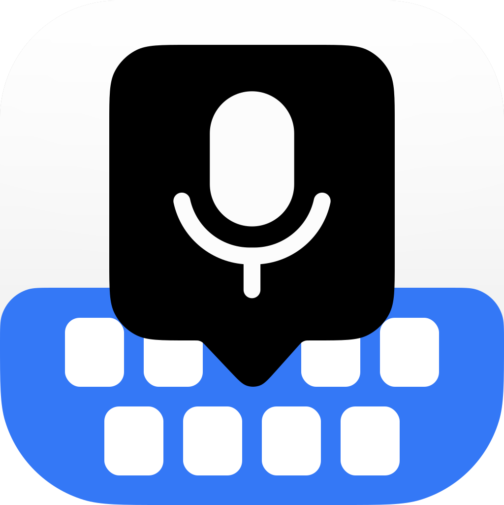
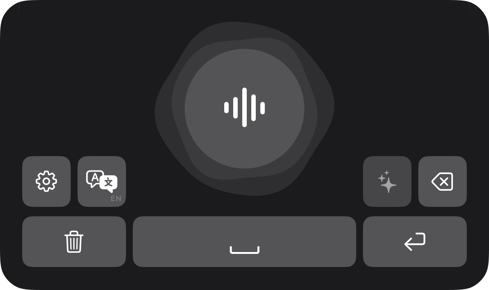
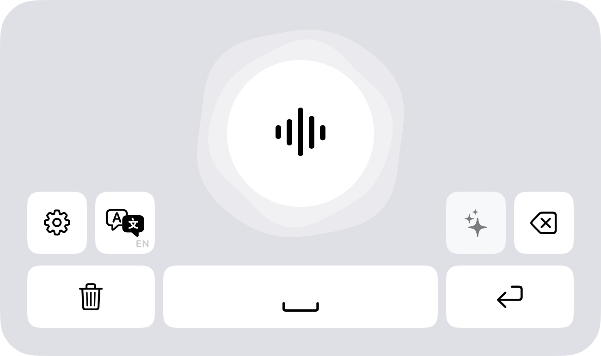
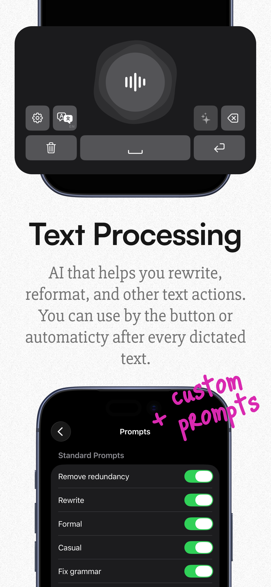
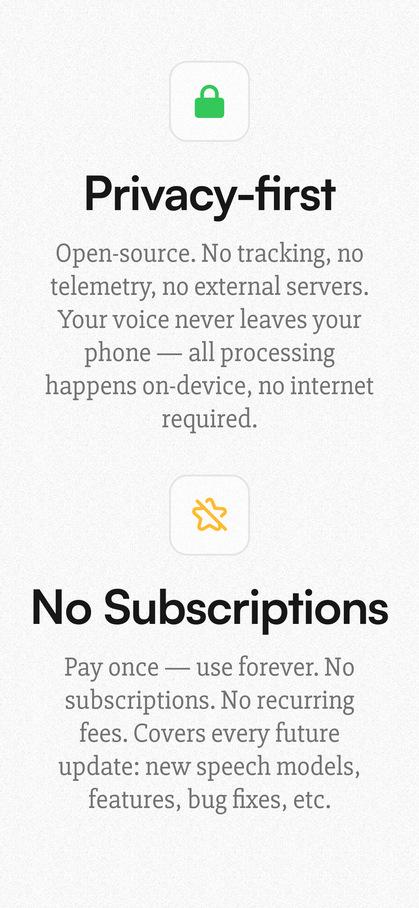
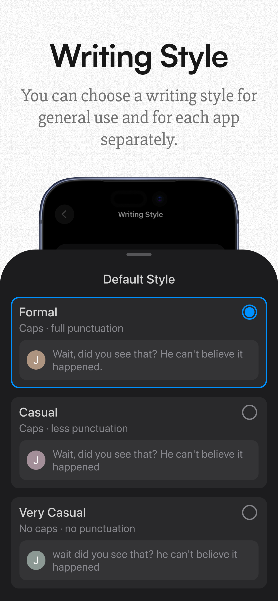
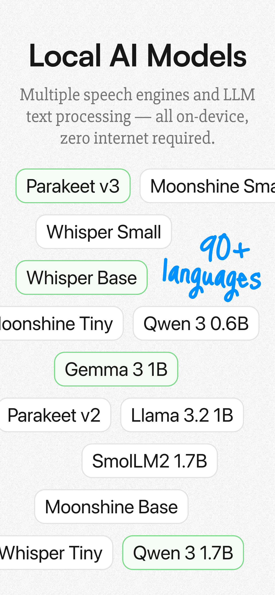

<div align="center">
<br>

</div>

<div align="center">

# Sayboard

</div>

<p align="center">
  This repository contains the complete source code of Sayboard — privacy-first voice keyboard for iOS. All speech recognition runs on-device with no servers, no accounts, and no tracking.
</p>

<p align="center">
  <a href="https://apps.apple.com/app/id6760622185">
    
  </a>
</p>

## Features

| Dark Mode                                                          | Light Mode                                                           |
| ------------------------------------------------------------------ | -------------------------------------------------------------------- |
|  |  |

- On-device speech recognition with multiple engines (WhisperKit, Moonshine, Parakeet)
- On-device LLM text processing: grammar correction, tone adjustment, rewriting
- Works as a system keyboard for voice dictation in any app
- 90+ languages with automatic language detection
- Fully offline — no internet required
- No analytics, no tracking, no accounts, no data collection

|  |  |  |  |
| ----------------------------------------------------------------------- | ------------------------------------------------------------------------- | --------------------------------------------------------------------- | ----------------------------------------------------------------------- |

## Building

To get started, you need a [Mac](https://www.apple.com/mac/), [Xcode](https://developer.apple.com/xcode/) 16.4+ (iOS 17.0+ deployment target), and a (free) [Apple Developer Account](https://developer.apple.com/programs/).

### 1. Install Dependencies

1. If your Xcode installation is fresh, make sure that command line tools are selected:

   ```sh
   sudo xcode-select --switch /Applications/Xcode.app
   ```

2. Install the tools needed to build the project:

   ```sh
   brew install xcodegen swiftformat swiftlint
   ```

   (If you don't have [Homebrew](https://brew.sh), see their [official install instructions](https://brew.sh).)

3. Download the llama.cpp XCFramework (required for on-device LLM features):

   ```sh
   ./scripts/bootstrap-llama.sh
   ```

### 2. Setup Project

1. Generate the Xcode project from `project.yml`:

   ```sh
   xcodegen generate
   ```

2. Open `Sayboard.xcodeproj` in Xcode

3. For both the `Sayboard` and `SayboardKeyboard` targets:
   1. Set "Team" to the team of your developer account under Signing & Capabilities

4. Choose `Sayboard` as scheme and a simulator

### 3. Build and Run

1. Build and Run (Cmd+R)

## Bug Reports and Questions

The best way to submit a bug report or support request is via email: [support@sayboard.app](mailto:support@sayboard.app).

Sayboard doesn't collect any analytics or telemetry, so we rely on your feedback to find and fix problems.

## Source Code Release Policy

This source code repository will be updated for every public non-beta release. There will be one commit per released version.

## Contributions

We welcome contributions via GitHub pull requests. For bug fixes and small improvements, feel free to open a PR directly. For larger changes, please open an issue first to discuss the approach.

## License

Sayboard is licensed under the [GNU General Public License v3](LICENSE).

    Copyright (c) 2025 Sayboard
    This program is free software: you can redistribute it and/or modify
    it under the terms of the GNU General Public License as published by
    the Free Software Foundation, either version 3 of the License, or
    (at your option) any later version.

    This program is distributed in the hope that it will be useful,
    but WITHOUT ANY WARRANTY; without even the implied warranty of
    MERCHANTABILITY or FITNESS FOR A PARTICULAR PURPOSE. See the
    GNU General Public License for more details.

    You should have received a copy of the GNU General Public License
    along with this program. If not, see <https://www.gnu.org/licenses/>.

We are publishing the source code in good faith, with transparency being the main goal. By having users pay for the development of the app, we can ensure that our goals sustainably align with the goals of our users: great privacy and security, no ads, no collection of user data.
